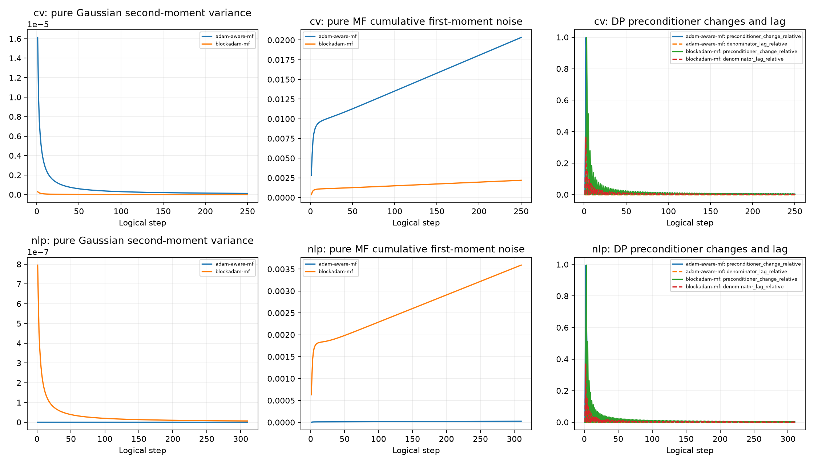

# blockadam-mf

The matrix equals Exp9 Momentum-Bias at the same horizon. Every step updates both moments and bias correction. Each block freezes the denominator from its first step after updating v; incomplete blocks follow the same rule.

All reported Exp10 full trainings are newly executed: 120 search + 24 review + 40 formal = 184.

Search: 20261101, five epochs, exactly 30 configurations per task/method (24 initial + six internal-validation refinements).

Top-2 reviewed on 20261102/03/04. Winner selected by four-seed mean internal accuracy; loss and trial ID break ties.

Formal paired seeds: 20261111–20261120. CV T=250, NLP T=310; search CV T=225.

Physical GPUs 1/2/3 only. FIFO; one CV or two NLP workers per GPU; no task mixing on a GPU.

Per-run epsilon=8, delta=1e-5, no sampling amplification. No epsilon=8 claim for composition of model selection and repeated training.

Internal validation is assumed public/non-protected. Diagnostics use DP optimizer state and public matrix/Gaussian geometry; raw training losses and clipping statistics are not logged.

Exp9 results are historical references, not new Exp10 trainings. Historical CV test-based tuning and prior viewing of SST-2 validation preclude any new blind-test claim.

Uncertainty: sample standard deviation (ddof=1), two-sided Student t 95% confidence intervals over ten seeds. Paired differences use each common seed.

| Task | Method | Mean accuracy | SD | 95% CI | LR | C | Module |
|---|---|---:|---:|---|---:|---:|---:|
| cv | adam-aware-mf | 0.7696 | 0.0055 | [0.7657, 0.7736] | 0.003 | 24.0 | 0.1 |
| cv | blockadam-mf | 0.0214 | 0.0089 | [0.0150, 0.0278] | 0.001 | 8.0 | 2 |
| nlp | adam-aware-mf | 0.7829 | 0.0077 | [0.7774, 0.7884] | 0.005 | 0.8 | 0.3 |
| nlp | blockadam-mf | 0.6604 | 0.0423 | [0.6302, 0.6907] | 0.0008 | 10 | 2 |

Formal mechanism geometry:

- cv: d=[1.0, -0.53161943769869, -0.0779998119461293, -0.2795535556950146], sensitivity=4.0656081, J1=6973.7088, J2(C=1)=3.5145579e-12, J2(actual C)=1.4395629e-08.

- nlp: d=[1.0, -0.50922865903301, -0.07727236688161641, -0.3143675658601789], sensitivity=4.184023, J1=7305.7385, J2(C=1)=3.2850206e-12, J2(actual C)=3.2850206e-08.

Preconditioner diagnostics use the first 64 flattened coordinates per parameter tensor. Denominator lag is the mean absolute relative difference between the frozen and live DP denominator.

Pure MF cumulative first-moment noise includes (1-beta1)=0.1; it excludes gradients, adaptive preconditioning, and parameter feedback. It is a mechanism diagnostic, not total optimization-error variance.
