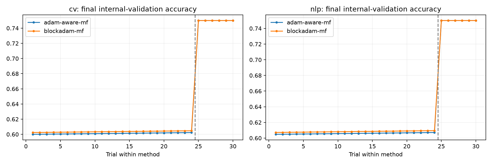
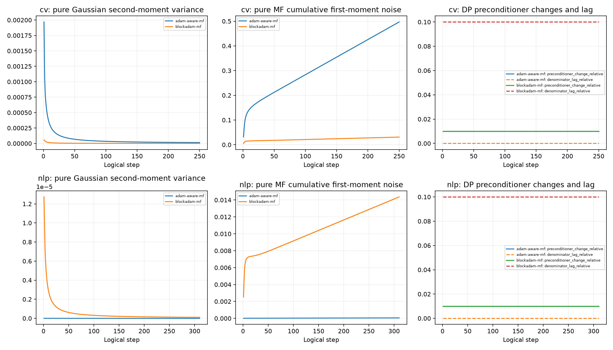

# Exp10 final report

All reported Exp10 full trainings are newly executed: 120 search + 24 review + 40 formal = 184.

Search: 20261101, five epochs, exactly 30 configurations per task/method (24 initial + six internal-validation refinements).

Top-2 reviewed on 20261102/03/04. Winner selected by four-seed mean internal accuracy; loss and trial ID break ties.

Formal paired seeds: 20261111–20261120. CV T=250, NLP T=310; search CV T=225.

Physical GPUs 1/2/3 only. FIFO; one CV or two NLP workers per GPU; no task mixing on a GPU.

Per-run epsilon=8, delta=1e-5, no sampling amplification. No epsilon=8 claim for composition of model selection and repeated training.

Internal validation is assumed public/non-protected. Diagnostics use DP optimizer state and public matrix/Gaussian geometry; raw training losses and clipping statistics are not logged.

Exp9 results are historical references, not new Exp10 trainings. Historical CV test-based tuning and prior viewing of SST-2 validation preclude any new blind-test claim.

Uncertainty: sample standard deviation (ddof=1), two-sided Student t 95% confidence intervals over ten seeds. Paired differences use each common seed.

| Task | Method | Mean accuracy | SD | 95% CI | LR | C | Module |
|---|---|---:|---:|---|---:|---:|---:|
| cv | adam-aware-mf | 0.7100 | 0.0000 | [0.7100, 0.7100] | 0.0024 | 100 | 3.0 |
| cv | blockadam-mf | 0.7000 | 0.0000 | [0.7000, 0.7000] | 0.006 | 30 | 25 |
| nlp | adam-aware-mf | 0.7100 | 0.0000 | [0.7100, 0.7100] | 0.004 | 1 | 3.0 |
| nlp | blockadam-mf | 0.7000 | 0.0000 | [0.7000, 0.7000] | 0.004 | 20 | 25 |

Paired accuracy differences (A minus B):

- cv: mean=0.01000, SD=0.00000, 95% CI=[0.01000, 0.01000].

- nlp: mean=0.01000, SD=0.00000, 95% CI=[0.01000, 0.01000].

[Module A](module_a_report.md) · [Module B](module_b_report.md) · [Freeze](frozen_manifest.json) · [Audit](audit_summary.json)

Audit: passed; protected historical/data/cache files unchanged: True.

Full numeric accuracy/loss/epsilon/runtime/memory statistics are in summary_statistics.csv. All candidate and five-epoch results are retained in search_results.json, recheck_results.json and final_results.json.
