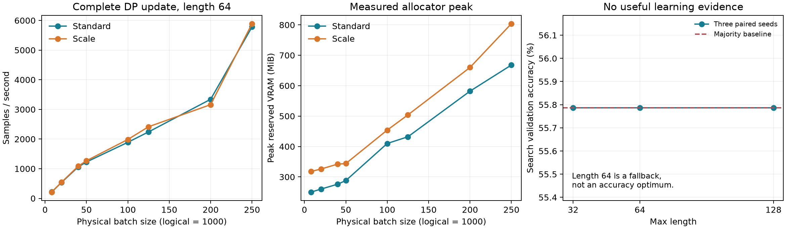

# Exp8a 实验报告

最终推荐 physical_batch_size=250，max_length=64。

本轮没有找到正常收敛的超参数：9个完整训练的Accuracy均等于多数类基线，validation loss随epoch上升。因此长度64是按协议的证据不足回退，不能据此宣称它的Accuracy最佳；最终physical batch的吞吐选择有效，冻结的lr/C/eps_scale不得作为已验证收敛的Exp8b超参数。

固定协议：BERT-Tiny 全参数普通二分类，CE，62,000 DP train / 5,349 search validation；官方 validation 从未下载或用于选择。1000 logical batch，5 epochs，310 steps；GDP ε=8、δ=1e-5，add/remove zero-out，无 sampling amplification，k=5、spacing=62。Adam (.9,.999,1e-8)，4 bands。

随机规则：固定分层 split 和排列，跨 epoch/seed/裁剪/长度重用；paired seed 初始化，noise seed+1 独立生成器。FP32，dropout=0，保证 physical partition 不改变 dropout 随机样本。所有 BERT/分类头参数可训练。

Embedding 优化：按 (sample, token) 聚合 backprops，重复 token 先求和再求范数；padding 导数置零；Scale 在聚合后逐坐标乘冻结 scale。CPU/CUDA 显式逐样本 autograd 验证了 embedding 范数、全 BERT 范数、裁剪系数及累积梯度。避免生成 B×V×H 的密集逐样本梯度；没有改变数学机制。

Embedding张量大小的理论估算（非未优化GPU实测）：原Scale的B×30522×128 FP32逐样本梯度在physical100/250时为约1.455/3.639 GiB，乘scale的临时张量可能再占同等大小。优化后完整step显存见实测表。

Momentum-Bias 使用完整非 Toeplitz bias-corrected 累计 workload，在 T=310 下以固定参与敏感度平方 × 全矩阵平均误差重新优化，未复用 T=250 系数。Scale 采用前一已完成 Adam step 的 vhat 冻结 scale；先累积剪裁梯度，在 scaled sum 空间加一次相关噪声，再 inverse scale 和除以1000。

Token 长度（含 [CLS]/[SEP]）实测：`{"P50": 10.0, "P90": 27.0, "P95": 33.0, "P99": 44.0}`；截断比例：`{"32": 0.054982256603661524, "64": 5.939212163506511e-05, "128": 0.0}`。

Length64短pilot实测（每个62 steps，共4次）：

| lr | C | eps_scale | Accuracy | loss |
|---:|---:|---:|---:|---:|
| 0.0005 | 1.0 | 0.1 | 0.557861 | 2.453663 |
| 5e-05 | 1.0 | 0.1 | 0.557861 | 0.717433 |
| 0.0001 | 1.0 | 0.1 | 0.557861 | 0.813226 |
| 5e-05 | 3.0 | 0.1 | 0.557861 | 0.717546 |

Physical batch 搜索实测（1 warmup + 3 完整测量 steps，CUDA 同步计时）：

| 裁剪 | 长度 | Physical batch | 状态 | samples/s | peak allocated GiB | peak reserved GiB |
|---|---:|---:|---|---:|---:|---:|
| standard | 64 | 8 | completed | 214.00 | 0.226 | 0.244 |
| scale | 64 | 8 | completed | 222.58 | 0.284 | 0.311 |
| standard | 64 | 20 | completed | 538.72 | 0.226 | 0.254 |
| scale | 64 | 20 | completed | 524.20 | 0.284 | 0.318 |
| standard | 64 | 40 | completed | 1031.81 | 0.240 | 0.270 |
| scale | 64 | 40 | completed | 1055.48 | 0.284 | 0.334 |
| standard | 64 | 50 | completed | 1265.21 | 0.257 | 0.281 |
| scale | 64 | 50 | completed | 1329.99 | 0.300 | 0.336 |
| standard | 64 | 100 | completed | 1934.70 | 0.332 | 0.400 |
| scale | 64 | 100 | completed | 2095.10 | 0.391 | 0.443 |
| standard | 64 | 125 | completed | 2455.49 | 0.372 | 0.422 |
| scale | 64 | 125 | completed | 2319.12 | 0.437 | 0.492 |
| standard | 64 | 200 | completed | 3297.49 | 0.490 | 0.568 |
| scale | 64 | 200 | completed | 3738.89 | 0.570 | 0.645 |
| standard | 64 | 250 | completed | 6206.45 | 0.563 | 0.652 |
| scale | 64 | 250 | completed | 5925.04 | 0.659 | 0.785 |

长度 benchmark 实测：

| 裁剪 | 长度 | Physical batch | 状态 | samples/s | peak allocated GiB | peak reserved GiB |
|---|---:|---:|---|---:|---:|---:|
| standard | 32 | 250 | completed | 5789.91 | 0.369 | 0.410 |
| scale | 32 | 250 | completed | 5862.98 | 0.492 | 0.578 |
| standard | 64 | 250 | completed | 5823.83 | 0.563 | 0.652 |
| scale | 64 | 250 | completed | 5768.73 | 0.659 | 0.785 |
| standard | 128 | 250 | completed | 5179.87 | 0.919 | 0.988 |
| scale | 128 | 250 | completed | 5398.56 | 1.015 | 1.086 |

完整 Momentum-Bias + Scale 训练实测：

| 长度 | seed | Accuracy | loss | 秒 |
|---|---:|---:|---:|---:|
| 128 | 20261011 | 0.557861 | 1.385010 | 60.8 |
| 128 | 20261012 | 0.557861 | 1.315390 | 61.1 |
| 128 | 20261013 | 0.557861 | 1.469622 | 58.2 |
| 32 | 20261011 | 0.557861 | 1.385676 | 52.9 |
| 32 | 20261012 | 0.557861 | 1.315803 | 57.9 |
| 32 | 20261013 | 0.557861 | 1.469157 | 57.1 |
| 64 | 20261011 | 0.557861 | 1.385013 | 53.1 |
| 64 | 20261012 | 0.557861 | 1.315393 | 57.4 |
| 64 | 20261013 | 0.557861 | 1.469623 | 56.8 |

Standard 完整训练 Accuracy 未测量（协议仅要求 Scale 长度 full runs）。所有 benchmark 的 Standard/Scale 吞吐和显存均为实测。

选定长度后的 physical batch 复测：

| 裁剪 | 长度 | Physical batch | 状态 | samples/s | peak allocated GiB | peak reserved GiB |
|---|---:|---:|---|---:|---:|---:|
| standard | 64 | 8 | completed | 216.12 | 0.226 | 0.244 |
| scale | 64 | 8 | completed | 210.77 | 0.284 | 0.311 |
| standard | 64 | 20 | completed | 538.27 | 0.226 | 0.254 |
| scale | 64 | 20 | completed | 547.51 | 0.284 | 0.318 |
| standard | 64 | 40 | completed | 1059.34 | 0.240 | 0.270 |
| scale | 64 | 40 | completed | 1084.07 | 0.284 | 0.334 |
| standard | 64 | 50 | completed | 1226.45 | 0.257 | 0.281 |
| scale | 64 | 50 | completed | 1269.12 | 0.300 | 0.336 |
| standard | 64 | 100 | completed | 1890.76 | 0.332 | 0.400 |
| scale | 64 | 100 | completed | 1986.63 | 0.391 | 0.443 |
| standard | 64 | 125 | completed | 2241.23 | 0.372 | 0.422 |
| scale | 64 | 125 | completed | 2415.69 | 0.437 | 0.492 |
| standard | 64 | 200 | completed | 3341.66 | 0.490 | 0.568 |
| scale | 64 | 200 | completed | 3161.05 | 0.570 | 0.645 |
| standard | 64 | 250 | completed | 5782.15 | 0.563 | 0.652 |
| scale | 64 | 250 | completed | 5892.39 | 0.659 | 0.785 |

选择依据：`{"batch": {"physical_batch_size": 250, "combined_steps_per_second": 5.836753087261826, "peak_reserved_bytes": 843055104}, "batch_candidates": [{"physical_batch_size": 8, "combined_steps_per_second": 0.21341023998438666, "peak_reserved_bytes": 333447168}, {"physical_batch_size": 20, "combined_steps_per_second": 0.5428508567004792, "peak_reserved_bytes": 341835776}, {"physical_batch_size": 40, "combined_steps_per_second": 1.0715615345334821, "peak_reserved_bytes": 358612992}, {"physical_batch_size": 50, "combined_steps_per_second": 1.247416497310621, "peak_reserved_bytes": 360710144}, {"physical_batch_size": 100, "combined_steps_per_second": 1.9375090567396436, "peak_reserved_bytes": 476053504}, {"physical_batch_size": 125, "combined_steps_per_second": 2.325191785931567, "peak_reserved_bytes": 528482304}, {"physical_batch_size": 200, "combined_steps_per_second": 3.2488457354483495, "peak_reserved_bytes": 692060160}, {"physical_batch_size": 250, "combined_steps_per_second": 5.836753087261826, "peak_reserved_bytes": 843055104}], "length": {"reason": "No length exceeds the majority baseline by 0.003; equal baseline accuracy is insufficient length evidence; prefer 64", "statistics": {"32": {"mean_accuracy": 0.557861282482707, "mean_gap_to_best": 0.0, "paired_gap_ci95": [0.0, 0.0], "paired_seeds": [20261011, 20261012, 20261013]}, "64": {"mean_accuracy": 0.557861282482707, "mean_gap_to_best": 0.0, "paired_gap_ci95": [0.0, 0.0], "paired_seeds": [20261011, 20261012, 20261013]}, "128": {"mean_accuracy": 0.557861282482707, "mean_gap_to_best": 0.0, "paired_gap_ci95": [0.0, 0.0], "paired_seeds": [20261011, 20261012, 20261013]}}, "tolerance": 0.003, "baseline_accuracy": 0.557861282482707, "convergence_evidence": false, "compute_and_truncation": {"32": {"combined_steps_per_second": 5.826214613118453, "peak_reserved_bytes": 620756992, "truncation_ratio": 0.054982256603661524}, "64": {"combined_steps_per_second": 5.796151718933878, "peak_reserved_bytes": 843055104, "truncation_ratio": 5.939212163506511e-05}, "128": {"combined_steps_per_second": 5.286957157017304, "peak_reserved_bytes": 1166016512, "truncation_ratio": 0.0}}, "full_runs": 9, "close_candidate_trigger": 0.006, "token_lengths_file": "exp8a/results/token_lengths.json"}, "initial_batch": {"physical_batch_size": 250, "combined_steps_per_second": 6.062484965534466, "peak_reserved_bytes": 843055104}, "initial_batch_candidates": [{"physical_batch_size": 8, "combined_steps_per_second": 0.21820355237255007, "peak_reserved_bytes": 333447168}, {"physical_batch_size": 20, "combined_steps_per_second": 0.531357302960291, "peak_reserved_bytes": 341835776}, {"physical_batch_size": 40, "combined_steps_per_second": 1.0435121213501186, "peak_reserved_bytes": 358612992}, {"physical_batch_size": 50, "combined_steps_per_second": 1.296791649302375, "peak_reserved_bytes": 360710144}, {"physical_batch_size": 100, "combined_steps_per_second": 2.0117076876873194, "peak_reserved_bytes": 476053504}, {"physical_batch_size": 125, "combined_steps_per_second": 2.3853596614590926, "peak_reserved_bytes": 528482304}, {"physical_batch_size": 200, "combined_steps_per_second": 3.5043430043826587, "peak_reserved_bytes": 692060160}, {"physical_batch_size": 250, "combined_steps_per_second": 6.062484965534466, "peak_reserved_bytes": 843055104}], "truncation": {"32": 0.054982256603661524, "64": 5.939212163506511e-05, "128": 0.0}}`。

吞吐统计覆盖 forward、两遍 backward、剪裁、logical accumulation、相关噪声和 Adam 更新及必要 non-finite 检查。reserved/allocated 为 PyTorch allocator 峰值，不包含驱动 context；选择以两者较大值保留至少20%显存，接近5%时选显存较小配置。

结果仅对 DP 训练机制按所述预算校准。多个 pilot/full run 的搜索总隐私消耗不等于单次 ε=8；本实验用公开 SST-2，未声称整个调参过程 ε=8。

结果图（实测；长度面板展示所有run停在多数类基线）：

补充实测：length=128，physical batch=1000；仅当OOM时回退500。各机制1 warmup + 3 measured完整DP logical steps。

| 裁剪 | 长度 | Physical batch | 状态 | samples/s | peak allocated GiB | peak reserved GiB |
|---|---:|---:|---|---:|---:|---:|
| standard | 128 | 1000 | completed | 8167.80 | 3.059 | 3.229 |
| scale | 128 | 1000 | completed | 8031.96 | 3.399 | 3.551 |

是否OOM并回退：False；本次可运行physical batch：1000；最小显存余量：69.50%。
