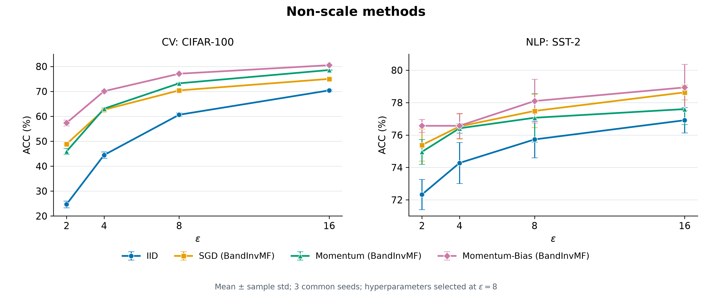
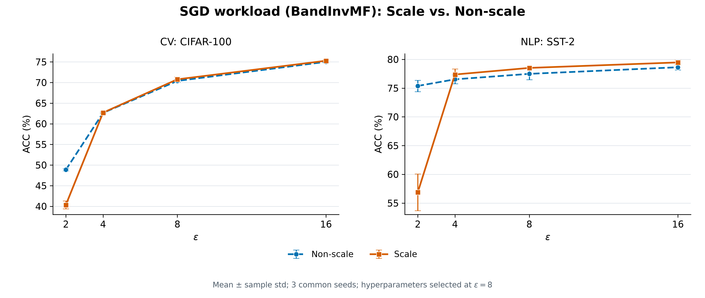
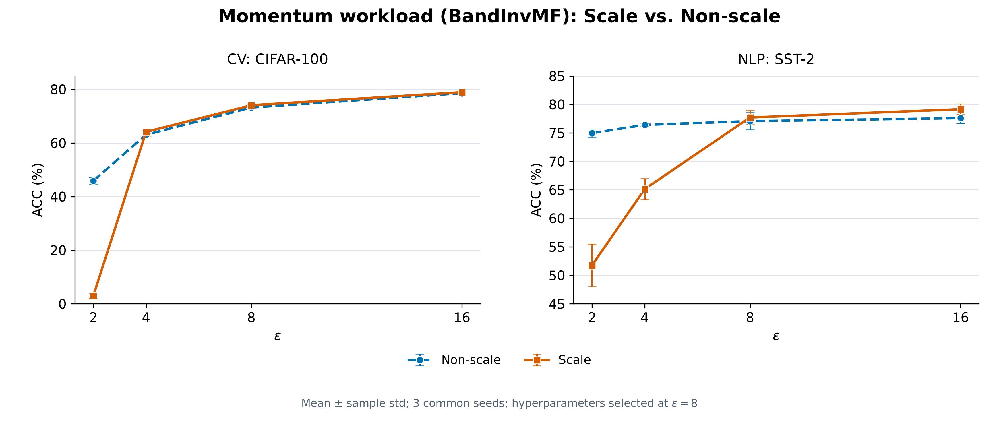
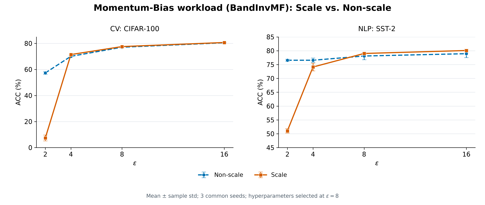

# Exp9 epsilon–ACC comparisons

CV: CIFAR-100 official test; NLP: SST-2 official validation. ACC is in percent.
Epsilon values: 2, 4, 8, 16. Every point uses seeds 20261111, 20261112, 20261113,
including epsilon=8. Error bars show sample standard deviation (ddof=1).
LR/C/eps_scale stay fixed at the configuration selected at epsilon=8.

Source: ../privacy_utility.json; all 56 points checked against ../final_results.json and ../sweep_results.json.
Displayed values: [CSV](epsilon_acc_plot_data.csv).

Regenerate from the repository root:
```bash
conda run --no-capture-output -n curve python -B -m exp9.runtime.plot_epsilon_comparisons
```



[PNG](epsilon_acc_non_scale.png) · [PDF](epsilon_acc_non_scale.pdf)



[PNG](epsilon_acc_scale_vs_non_scale_sgd.png) · [PDF](epsilon_acc_scale_vs_non_scale_sgd.pdf)



[PNG](epsilon_acc_scale_vs_non_scale_momentum.png) · [PDF](epsilon_acc_scale_vs_non_scale_momentum.pdf)



[PNG](epsilon_acc_scale_vs_non_scale_momentum_bias.png) · [PDF](epsilon_acc_scale_vs_non_scale_momentum_bias.pdf)
