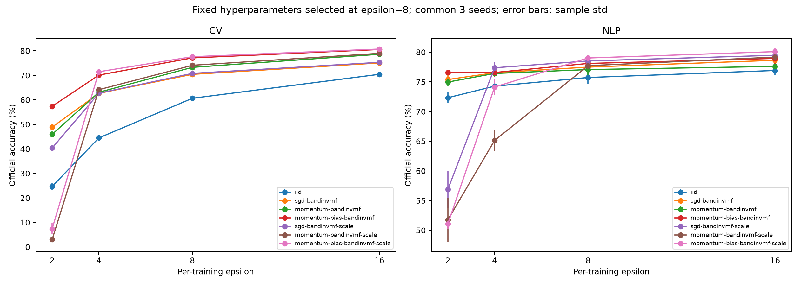
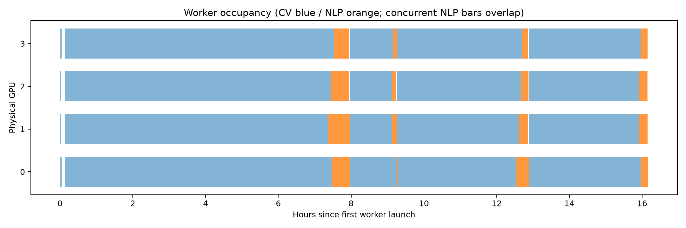
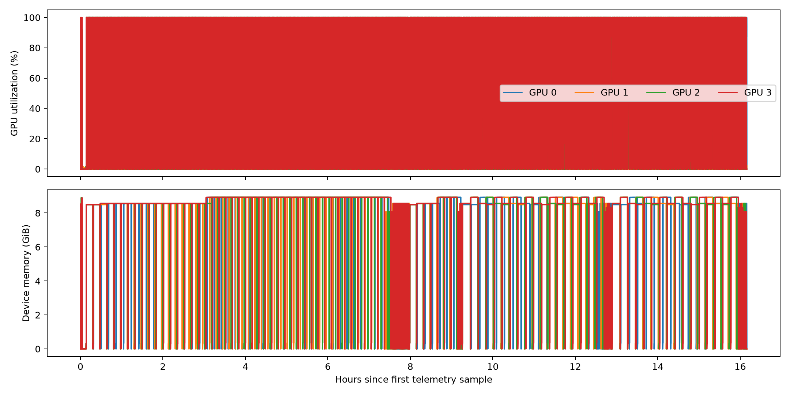

# Exp9 paper experiments

321 fixed-grid + 56 Top-2 review + 140 formal + 126 fixed-hyperparameter sweep trials.
Selection uses only final-epoch internal validation. The 14 frozen configurations and SHA256 manifest precede official evaluations.

| Task | Method | Mean accuracy (%) | Sample std (%) | t 95% CI (%) |
|---|---|---:|---:|---|
| cv | dp-adam-iid | 60.189 | 1.796 | [58.904, 61.474] |
| cv | dp-adam-sgd-bandinvmf | 70.223 | 0.531 | [69.843, 70.603] |
| cv | dp-adam-momentum-bandinvmf | 72.982 | 0.937 | [72.312, 73.652] |
| cv | dp-adam-momentum-bias-bandinvmf | 76.724 | 0.599 | [76.296, 77.152] |
| cv | dp-adam-sgd-bandinvmf-scale | 70.610 | 0.701 | [70.109, 71.111] |
| cv | dp-adam-momentum-bandinvmf-scale | 73.836 | 0.900 | [73.192, 74.480] |
| cv | dp-adam-momentum-bias-bandinvmf-scale | 77.252 | 0.601 | [76.822, 77.682] |
| nlp | dp-adam-iid | 75.986 | 0.911 | [75.334, 76.638] |
| nlp | dp-adam-sgd-bandinvmf | 77.718 | 0.793 | [77.151, 78.285] |
| nlp | dp-adam-momentum-bandinvmf | 76.789 | 0.875 | [76.163, 77.415] |
| nlp | dp-adam-momentum-bias-bandinvmf | 77.936 | 0.969 | [77.243, 78.629] |
| nlp | dp-adam-sgd-bandinvmf-scale | 78.647 | 0.635 | [78.193, 79.101] |
| nlp | dp-adam-momentum-bandinvmf-scale | 77.408 | 1.036 | [76.667, 78.149] |
| nlp | dp-adam-momentum-bias-bandinvmf-scale | 79.174 | 0.557 | [78.776, 79.573] |

Ten common seeds at epsilon=8; paired differences and all 21 method-pair comparisons per task are in paired_effects.csv. Intervals and comparisons are descriptive and have no multiple-comparison correction.

Privacy–Utility uses epsilon={2,4,8,16}, three common seeds, and epsilon=8 frozen LR/C/eps_scale. This is a fixed-hyperparameter protocol; other epsilon values were not independently tuned.

Each successful training has its own audited add/remove zero-out GDP budget, delta=1e-5, without sampling amplification. Internal validation is treated as public/non-protected; repeated training, selection, and released validation scores are not automatically a single epsilon=8 DP procedure. Private validation would require separate protection/accounting.

Evaluation limitations: previous CV experiments selected parameters using official test; NLP official validation was previously viewed. These evaluations are not newly blind held-out tests.

Artifacts: [raw final](final_raw.csv), [main table](main_table.csv), [workload/geometry](workload_geometry.csv), [paired differences](paired_effects.csv), [privacy–utility](privacy_utility.csv), [freeze](frozen_manifest.json), [audit](audit_summary.json), [compute](compute_summary.csv), [GPU samples](gpu_utilization.csv).

