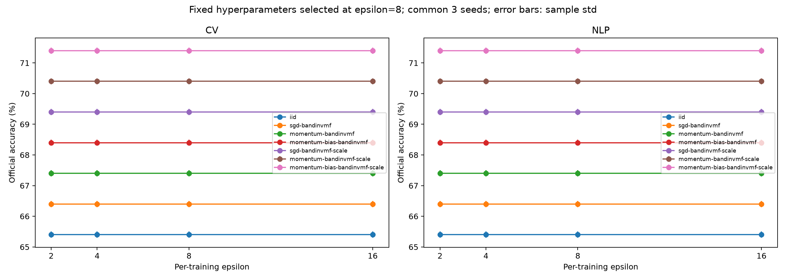

# Exp9 paper experiments

321 fixed-grid + 56 Top-2 review + 140 formal + 126 fixed-hyperparameter sweep trials.
Selection uses only final-epoch internal validation. The 14 frozen configurations and SHA256 manifest precede official evaluations.

| Task | Method | Mean accuracy (%) | Sample std (%) | t 95% CI (%) |
|---|---|---:|---:|---|
| cv | dp-adam-iid | 65.330 | 0.189 | [65.195, 65.465] |
| cv | dp-adam-sgd-bandinvmf | 66.330 | 0.189 | [66.195, 66.465] |
| cv | dp-adam-momentum-bandinvmf | 67.330 | 0.189 | [67.195, 67.465] |
| cv | dp-adam-momentum-bias-bandinvmf | 68.330 | 0.189 | [68.195, 68.465] |
| cv | dp-adam-sgd-bandinvmf-scale | 69.330 | 0.189 | [69.195, 69.465] |
| cv | dp-adam-momentum-bandinvmf-scale | 70.330 | 0.189 | [70.195, 70.465] |
| cv | dp-adam-momentum-bias-bandinvmf-scale | 71.330 | 0.189 | [71.195, 71.465] |
| nlp | dp-adam-iid | 65.330 | 0.189 | [65.195, 65.465] |
| nlp | dp-adam-sgd-bandinvmf | 66.330 | 0.189 | [66.195, 66.465] |
| nlp | dp-adam-momentum-bandinvmf | 67.330 | 0.189 | [67.195, 67.465] |
| nlp | dp-adam-momentum-bias-bandinvmf | 68.330 | 0.189 | [68.195, 68.465] |
| nlp | dp-adam-sgd-bandinvmf-scale | 69.330 | 0.189 | [69.195, 69.465] |
| nlp | dp-adam-momentum-bandinvmf-scale | 70.330 | 0.189 | [70.195, 70.465] |
| nlp | dp-adam-momentum-bias-bandinvmf-scale | 71.330 | 0.189 | [71.195, 71.465] |

Ten common seeds at epsilon=8; paired differences and all 21 method-pair comparisons per task are in paired_effects.csv. Intervals and comparisons are descriptive and have no multiple-comparison correction.

Privacy–Utility uses epsilon={2,4,8,16}, three common seeds, and epsilon=8 frozen LR/C/eps_scale. This is a fixed-hyperparameter protocol; other epsilon values were not independently tuned.

Each successful training has its own audited add/remove zero-out GDP budget, delta=1e-5, without sampling amplification. Internal validation is treated as public/non-protected; repeated training, selection, and released validation scores are not automatically a single epsilon=8 DP procedure. Private validation would require separate protection/accounting.

Evaluation limitations: previous CV experiments selected parameters using official test; NLP official validation was previously viewed. These evaluations are not newly blind held-out tests.

Artifacts: [raw final](final_raw.csv), [main table](main_table.csv), [workload/geometry](workload_geometry.csv), [paired differences](paired_effects.csv), [privacy–utility](privacy_utility.csv), [freeze](frozen_manifest.json), [audit](audit_summary.json), [compute](compute_summary.csv), [GPU samples](gpu_utilization.csv).

